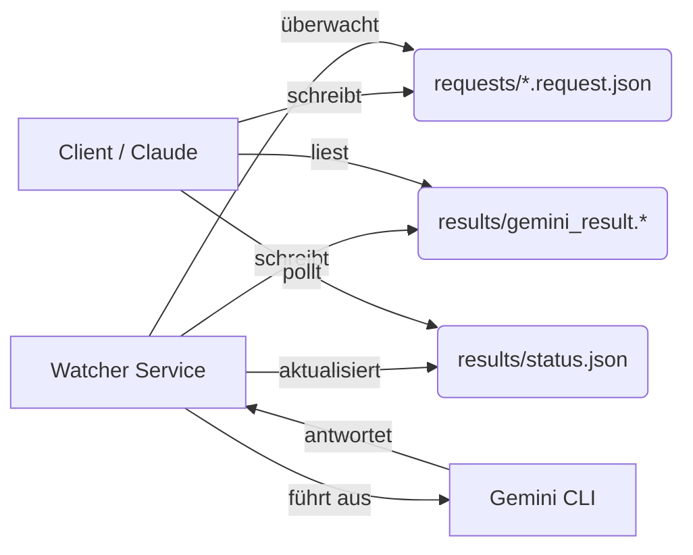

# Technische Dokumentation: Gemini Search Watcher

Diese Dokumentation beschreibt die interne Funktionsweise, Datenstrukturen und Implementierungsdetails des Gemini Search Watcher Systems.

## 🏗 Systemarchitektur

Das System folgt einem asynchronen **File-Based Messaging Pattern**. Es entkoppelt den Anfragesteller (Client) vom Ausführenden (Worker), um Timeouts zu vermeiden und Stabilität zu gewährleisten.

### Architektur-Diagramm



---

## 💾 Datenstrukturen & API

Die Schnittstelle ist das Dateisystem. Alle Pfade sind relativ zum Root des Projekts.

### 1. Request Objekt (`requests/*.request.json`)
Wird vom Client erstellt.
- **Namenskonvention**: `*.request.json`
- **Schema**:
```json
{
  "id": "string (opt, UUID oder Timestamp)",
  "query": "string (erforderlich, die Suchanfrage)",
  "format": "enum (opt, 'md' | 'json', default: 'md')"
}
```

### 2. Status Objekt (`results/status.json`)
Wird vom Watcher kontinuierlich aktualisiert, dient dem Polling des Clients.
- **Schema**:
```json
{
  "status": "enum ('idle' | 'searching' | 'complete' | 'error')",
  "query": "string (letzte verarbeitete Query)",
  "started": "ISO8601 Timestamp",
  "completed": "ISO8601 Timestamp (nur bei complete)",
  "request_id": "string",
  "result_file": "string (voller Pfad zur Ergebnisdatei)",
  "error": "string (nur bei error)"
}
```

### 3. Ergebnis Dateien
- **Markdown (`results/gemini_result.md`)**: Reiner Text-Output, bereinigt um CLI-Logs.
- **JSON (`results/gemini_result.json`)**:
```json
{
  "query": "string",
  "timestamp": "ISO8601",
  "request_id": "string",
  "source": "gemini-cli",
  "model": "gemini-2.5-pro",
  "response": "string (der eigentliche Inhalt)"
}
```

### 4. Ready Flag (`results/ready.flag`)
Ein einfaches JSON-File, das als atomares Signal für den Abschluss dient. Nützlich für File-Watcher auf Client-Seite, die nicht pollen wollen.

---

## ⚙️ Implementierungsdetails (`gemini_watcher.py`)

### Initialisierung
- Der Pfad `BASE_DIR` wird dynamisch zur Laufzeit ermittelt (`Path(__file__).resolve().parent`).
- Verzeichnisse `requests/` und `results/` werden bei Start erzwungen (`ensure_directories()`).

### Der Watch-Loop
- **Polling-Intervall**: 2 Sekunden (`POLL_INTERVAL`).
- Der Watcher nutzt `glob("*.request.json")` um neue Aufträge zu finden.
- Die Verarbeitung geschieht **synchron** (FIFO - First In, First Out).
- Während der Verarbeitung wird `requests/*.request.json` gesperrt/gelöscht, um Race Conditions zu minimieren.

### Verarbeitung (`process_request`)
1. **Lesen**: JSON Parsen der Request-Datei.
2. **Status Update**: Setzt `status.json` auf `searching`.
3. **Escaping**: Einfaches Sanitizing der Query für die Shell (ersetzt `"` durch `'`).
4. **Execution**:
   - Nutzt `subprocess.run`
   - Command: `gemini -p "{query}" --output-format text --yolo`
   - `--yolo`: Überspringt Sicherheitsbestätigungen der CLI.
   - `cwd`: Wird auf `BASE_DIR` gesetzt, damit die CLI Zugriff auf `GEMINI.md` (System Instructions) hat.
5. **Cleaning (`clean_response`)**:
   - Die Gemini CLI gibt oft Ladebalken, Warnungen oder "Kreditkarten"-Infos auf stdout aus.
   - Die Funktion filtert Zeilen basierend auf einer Blacklist (`skip_phrases`).
   - Entfernt PowerShell-Artefakte (Zeilen die mit `+` beginnen).
6. **Speichern**: Schreibt Ergebnis und aktualisiert `status.json` auf `complete`.

### Fehlerbehandlung
- Exceptions im Loop werden gefangen, geloggt und in `status.json` als `status: error` vermerkt.
- Das Skript bricht bei Einzelfehlern nicht ab.
- Zeitüberschreitung (Timeout) für die CLI ist auf 300 Sekunden gesetzt.

---

## 🛠 Erweiterbarkeit

Das System kann leicht angepasst werden:

- **Anderes Modell**: Ändern des CLI Befehls in Zeile 116 (z.B. Flags für andere Modelle hinzufügen).
- **Mehrere Worker**: Aktuell nicht unterstützt (Race Conditions bei `results/` Dateien). Für Parallelisierung müssten die Output-Dateinamen eindeutige IDs enthalten, anstatt statisch `gemini_result.json` zu heißen.
